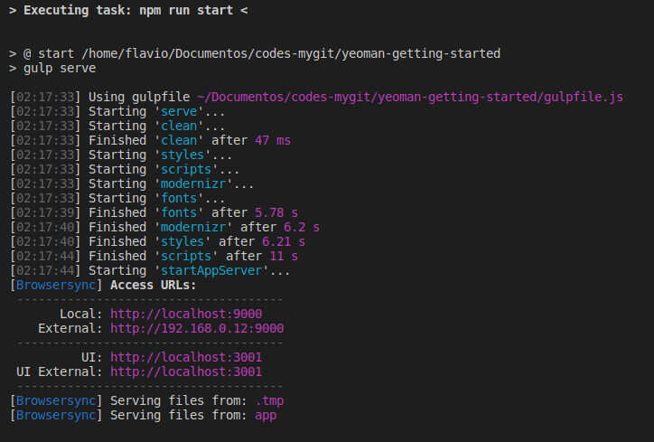
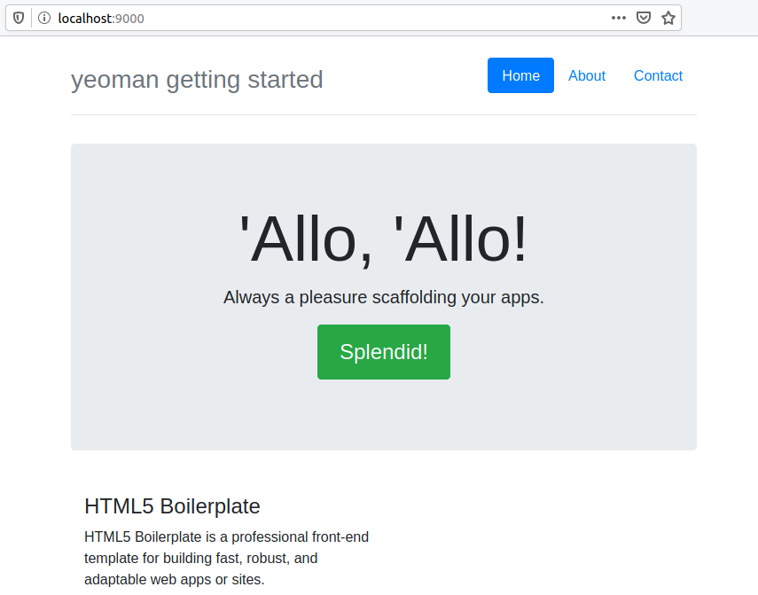

#  Yeoman

### Install

First thing is to install yo using npm.

    npm install -g yo

Result...

    ...
    ...
    ...
    Thank you for installing EJS: built with the Jake JavaScript build tool (https://jakejs.com/)

    > spawn-sync@1.0.15 postinstall /home/flavio/.nvm/versions/node/v13.7.0/lib/node_modules/yo/node_modules/spawn-sync
    > node postinstall

    > yo@3.1.1 postinstall /home/flavio/.nvm/versions/node/v13.7.0/lib/node_modules/yo
    > yodoctor

    Yeoman Doctor
    Running sanity checks on your system

    ✔ No .bowerrc file in home directory
    ✔ Global configuration file is valid
    ✔ NODE_PATH matches the npm root
    ✔ No .yo-rc.json file in home directory
    ✔ Node.js version
    ✔ npm version
    ✔ yo version

    Everything looks all right!
    + yo@3.1.1
    added 671 packages from 379 contributors in 84.212s

### Install generator(s)

Generators are npm packages named generator-XYZ. 

To install the webapp generator:

    npm install -g generator-webapp

Result...

    > ejs@2.7.4 postinstall /home/flavio/.nvm/versions/node/v13.7.0/lib/node_modules/generator-webapp/node_modules/ejs
    > node ./postinstall.js

    Thank you for installing EJS: built with the Jake JavaScript build tool (https://jakejs.com/)

    > spawn-sync@1.0.15 postinstall /home/flavio/.nvm/versions/node/v13.7.0/lib/node_modules/generator-webapp/node_modules/spawn-sync
    > node postinstall

    + generator-webapp@4.0.0-8
    added 440 packages from 295 contributors in 19.121s

### This example

    mkdir yeoman-getting-started/ && cd $_
    yo webapp

### Executing

    npm start

